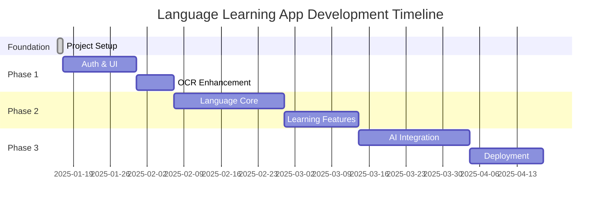

# Development Milestone Tracker

## 📈 PROJECT OVERVIEW

**Project**: Language Learning App with Visual OCR & Speech Recognition  
**Started**: January 16, 2025  
**Current Phase**: Foundation Complete - Ready for Phase 1A  
**Overall Progress**: 25% Complete  

---

## 🏆 MAJOR MILESTONES

### ✅ Milestone 1: Project Foundation (COMPLETED)
**Duration**: Day 1 (Jan 16, 2025)  
**Status**: ✅ COMPLETE  
**Progress**: 100%

#### Deliverables Completed:
- [x] Complete project architecture setup
- [x] FastAPI backend with PostgreSQL integration
- [x] Expo React Native frontend foundation
- [x] Docker development environment
- [x] Authentication system foundation
- [x] OCR image processing capability
- [x] Internationalization framework
- [x] Comprehensive documentation

#### Technical Achievements:
- 58 files created with 17,095+ lines of code
- Full Docker containerization
- API endpoints: `/auth/*`, `/ocr/extract-text`
- Multi-language support (EN/ES/JA)
- Mobile navigation and camera integration

---

## 🎯 UPCOMING MILESTONES

### 📱 Milestone 2: Core Authentication & UI
**Target**: Week 2-3 (Jan 23-30, 2025)  
**Status**: 🔄 PENDING  
**Estimated Progress**: 0%

#### Key Deliverables:
- [ ] Complete user authentication UI (login/register screens)
- [ ] Frontend-backend authentication integration
- [ ] Secure token management
- [ ] User profile management
- [ ] Enhanced OCR camera functionality

#### Success Criteria:
- Users can register and login through mobile app
- Secure session management implemented
- OCR functionality accessible to authenticated users
- Password reset and recovery working

---

### 🧠 Milestone 3: Language Learning Core
**Target**: Week 4-6 (Feb 1-14, 2025)  
**Status**: ⏳ PLANNED  
**Estimated Progress**: 0%

#### Key Deliverables:
- [ ] Text-to-Speech integration
- [ ] Speech-to-Text functionality
- [ ] Translation services
- [ ] Basic vocabulary management
- [ ] Text processing pipeline

#### Success Criteria:
- OCR text can be read aloud in multiple languages
- Users can practice pronunciation with feedback
- Automatic translation between supported languages
- Vocabulary extraction and storage working

---

### 🎓 Milestone 4: Learning Features & Exercises
**Target**: Week 7-10 (Feb 15 - Mar 15, 2025)  
**Status**: 📋 PLANNED  
**Estimated Progress**: 0%

#### Key Deliverables:
- [ ] Grammar analysis and correction
- [ ] Interactive practice exercises
- [ ] Progress tracking system
- [ ] Spaced repetition algorithm
- [ ] Lesson management

#### Success Criteria:
- Users can practice with generated exercises
- Progress tracking and analytics available
- Personalized learning recommendations
- Structured lesson paths implemented

---

### 🤖 Milestone 5: AI Integration & Advanced Features
**Target**: Week 11-14 (Mar 16 - Apr 12, 2025)  
**Status**: 🔮 FUTURE  
**Estimated Progress**: 0%

#### Key Deliverables:
- [ ] AI conversation partner
- [ ] Advanced analytics
- [ ] Social features
- [ ] Gamification system
- [ ] Performance optimization

#### Success Criteria:
- AI-powered conversation practice
- Comprehensive learning analytics
- Social sharing and community features
- Smooth app performance

---

### 🚀 Milestone 6: Production Deployment
**Target**: Week 15-16 (Apr 13-26, 2025)  
**Status**: 🔮 FUTURE  
**Estimated Progress**: 0%

#### Key Deliverables:
- [ ] Production infrastructure setup
- [ ] App Store deployment (iOS)
- [ ] Play Store deployment (Android)
- [ ] Monitoring and analytics
- [ ] User onboarding optimization

#### Success Criteria:
- App available in app stores
- Production monitoring active
- User feedback collection system
- Scalable infrastructure deployed

---

## 📊 PROGRESS TRACKING

### Overall Project Completion
```
Foundation     ████████████████████████████████████████ 100%
Authentication ░░░░░░░░░░░░░░░░░░░░░░░░░░░░░░░░░░░░░░░░   0%
Language Core  ░░░░░░░░░░░░░░░░░░░░░░░░░░░░░░░░░░░░░░░░   0%
Learning Sys   ░░░░░░░░░░░░░░░░░░░░░░░░░░░░░░░░░░░░░░░░   0%
AI Features    ░░░░░░░░░░░░░░░░░░░░░░░░░░░░░░░░░░░░░░░░   0%
Deployment     ░░░░░░░░░░░░░░░░░░░░░░░░░░░░░░░░░░░░░░░░   0%

Total Progress: ██████░░░░░░░░░░░░░░░░░░░░░░░░░░░░░░░░░░ 25%
```

### Component Status Dashboard
| Component | Status | Completion | Next Action |
|-----------|--------|------------|-------------|
| Backend API | ✅ Complete | 90% | Add remaining endpoints |
| Frontend UI | 🔄 In Progress | 30% | Build auth screens |
| Database | ✅ Complete | 80% | Add learning models |
| Authentication | 🔄 Partial | 60% | Complete UI integration |
| OCR System | ✅ Functional | 70% | Enhance accuracy |
| Translation | ⏳ Planned | 0% | Integrate APIs |
| TTS/STT | ⏳ Planned | 0% | Service setup |
| Analytics | ⏳ Planned | 0% | Design system |

---

## ⚡ DEVELOPMENT VELOCITY

### Week 1 Achievements (Jan 16, 2025):
- **Lines of Code**: 17,095+
- **Files Created**: 58
- **Features Completed**: 8 major components
- **Velocity**: Exceptional (Foundation sprint)

### Projected Velocity:
- **Phase 1A (Auth/UI)**: 2 weeks - Medium complexity
- **Phase 2A (Language)**: 3 weeks - High complexity  
- **Phase 2B (Learning)**: 2 weeks - Medium complexity
- **Phase 3A (AI)**: 3 weeks - High complexity

---

## 🎯 KEY SUCCESS METRICS

### Technical Metrics:
- [ ] **90%+ Test Coverage** (Target: Milestone 3)
- [ ] **<2s API Response Times** (Target: Milestone 4)  
- [ ] **95%+ OCR Accuracy** (Target: Milestone 2)
- [ ] **Cross-platform Compatibility** (Target: Milestone 6)

### User Experience Metrics:
- [ ] **<30s User Onboarding** (Target: Milestone 6)
- [ ] **80%+ Feature Adoption** (Target: Post-launch)
- [ ] **4.5+ App Store Rating** (Target: Post-launch)
- [ ] **<5% Daily Churn Rate** (Target: Post-launch)

---

## 📅 CRITICAL PATH TIMELINE



---

## 🚨 RISK MONITORING

### Current Risks:
- **LOW RISK**: Well-architected foundation reduces technical debt
- **LOW RISK**: Docker environment ensures consistent development
- **MEDIUM RISK**: API integration complexity (TTS/STT services)
- **MEDIUM RISK**: Mobile platform differences (iOS/Android)

### Risk Mitigation:
- Early API testing and fallback options
- Platform-specific testing throughout development
- Regular milestone reviews and adjustments
- Buffer time in timeline for complex integrations

---

*Last Updated: January 16, 2025*  
*Next Review: January 23, 2025*  
*Milestone Target: Complete Phase 1A by January 30, 2025*